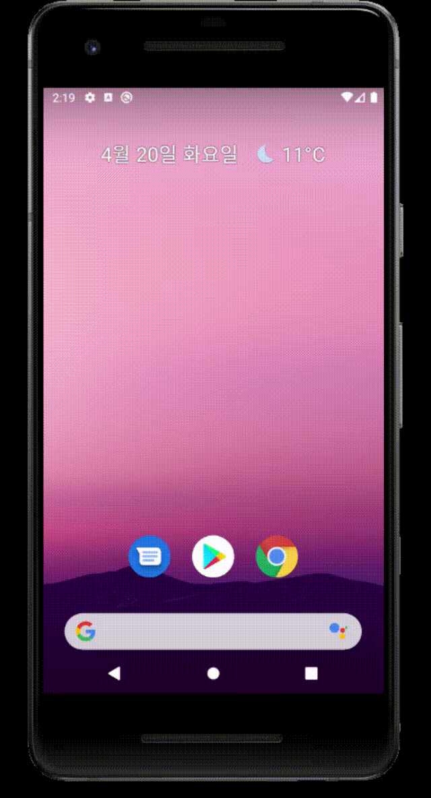
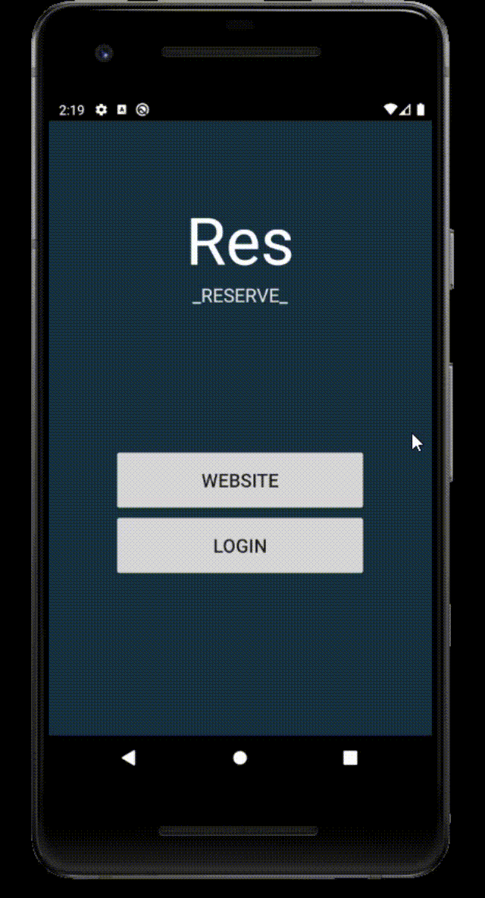
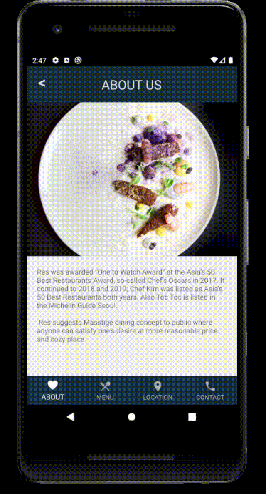
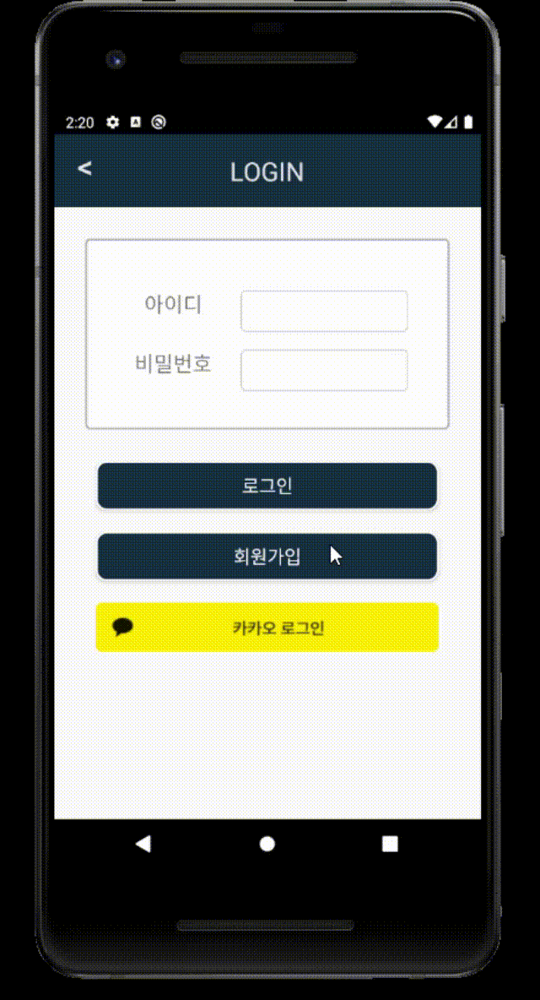
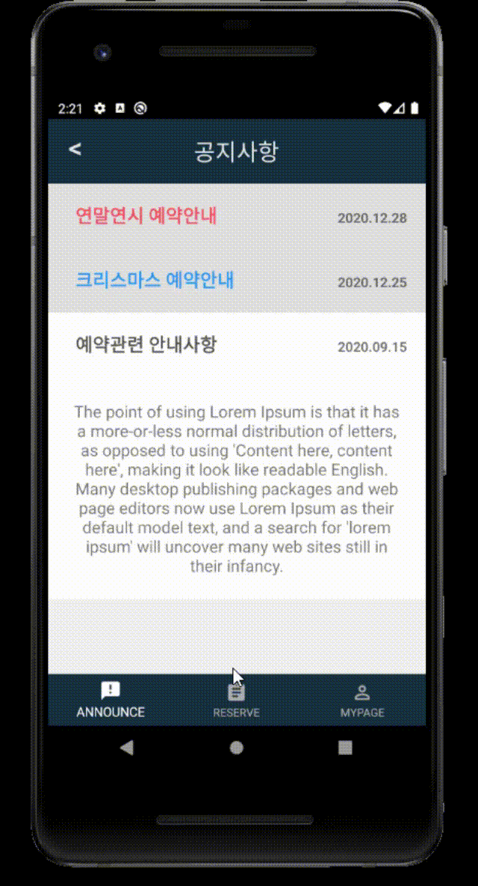
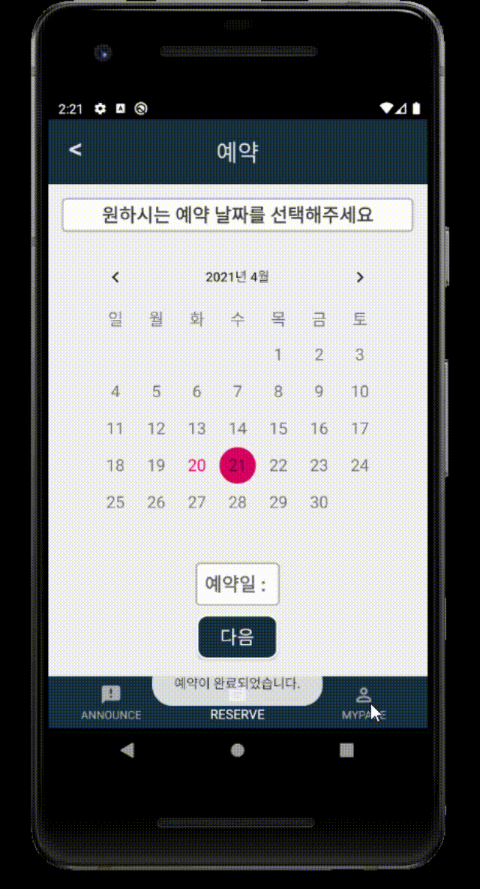
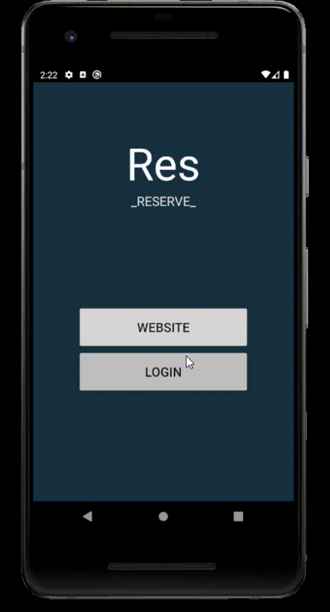
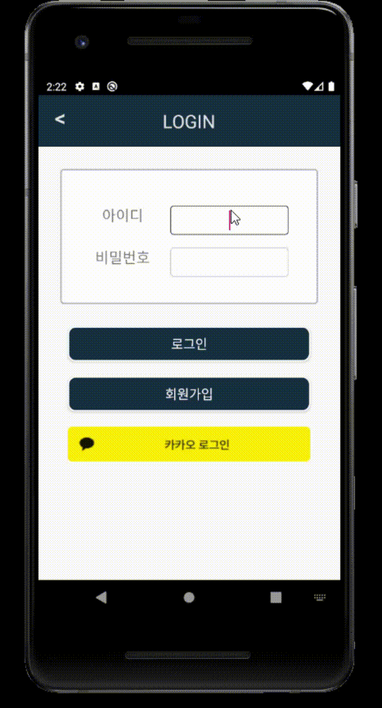

# 🍴 Res_Reserve

> 레스토랑 관리자와 예약 서비스 사용자를 위한 Android 어플리케이션

  

사용자의 레스토랑 예약, 관리자의 회원 및 예약 관리, 레스토랑 정보 제공 등

## 사용 예제
> Splash & 메인화면

 
이미지 보기/숨기기

> 레스토랑 정보 제공

 
이미지 보기/숨기기

> Menu Tab 상세 기능

 
이미지 보기/숨기기

> Contact 외부 앱 연결

 
이미지 보기/숨기기

> 카카오 계정으로 로그인

 
이미지 보기/숨기기

> 회원가입

 
이미지 보기/숨기기

> 회원가입 아이디로 로그인

 
이미지 보기/숨기기

> 공지사항 확인

 
이미지 보기/숨기기

> 레스토랑 예약하기

 
이미지 보기/숨기기

> 마이페이지에서 예약 관리 및 정보 수정

 
이미지 보기/숨기기

> 관리자 로그인

 
이미지 보기/숨기기

> 데이터베이스 정삭 작동 확인

 
이미지 보기/숨기기

